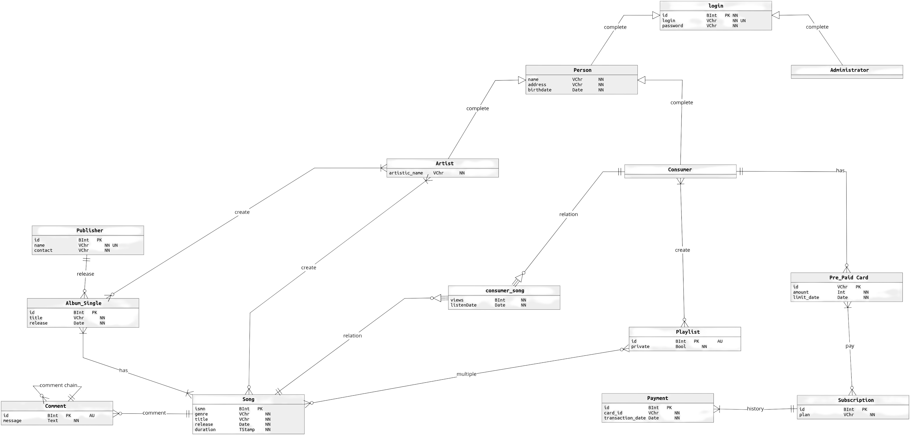
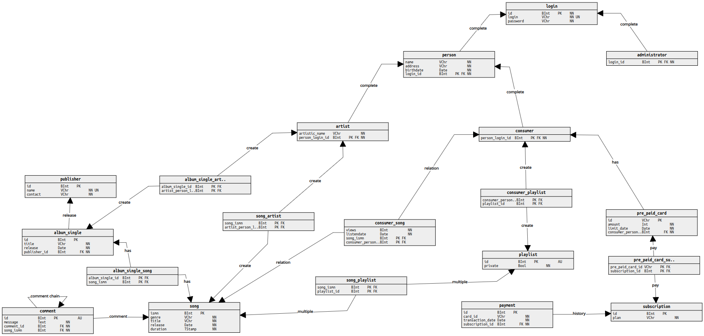

# Oblivion Sound
TODO: Write the project description

## Main Operations:
<ul>
  <li>
    <h3><b>Administrator</b></h3>
    <ul>
      <li>Create artist accounts</li>
      <li>Create pre-paid cards (10, 25 or 50)</li>
    </ul>
  </li>
  <li>
    <h3><b>Consumer</b></h3>
    <ul>
      <li><h4><b>Consumer w/o subscription</b></h4>
        <ul>
          <li>Create their account</li>
          <li>Buy a pre-paid card</li>
          <li>Buy a subscription (month, quarter or semester)</li>
        </ul>
      </li>
      <li><h4><b>Consumer w/ subscription</b></h4>
        <ul>
          <li>Create playlists (public or private)</li>
          <li>Add songs to their playlists</li>
          <li>Remove songs from their playlists</li>
          <li>Access their private playlists</li>
          <li>Update their playlist name</li>
          <li>Delete their playlists</li>
        </ul>
      </li>
      <li><h4><b>Both</b></h4>
        <ul>
          <li>Comment on songs or on another comments</li>
          <li>Access to all songs, albums and public playlists</li>
          <li>Have a playlist with their top 10 most played songs (last 30 days)</li>
          <li>Update and delete their account</li>
        </ul>
      </li>
    </ul>
  </li>
  <li><h3><b>Artist</b></h3>
    <ul>
      <li>Create albums</li>
      <li>Create songs</li>
      <li>Update their account information</li>
    </ul>
  </li>
</ul>

## Potential concurrency conflicts:
- Creating a new account:
  - The same username can't be used twice
- Simultaneous comments:
  - Multiple comments at the same time can cause the comments to be out of order or to be with the wrong content
- Simultaneous subscriptions and pre-paid cards
- Simultaneous playlist creation, update and deletion
- Simultaneous song creation, update and deletion
- Simultaneous album creation, update and deletion

## ER diagram (Conceptual Model):

  
  <b>Figure 1:</b> Conceptual Model - <i>can be changed</i>

### Description:
- TODO: Write the description

## Relational data model (Physical Model):

  
  <b>Figure 2:</b> Physical Model - <i>can be changed</i>

 
 
 
 
 

## Authors:
- André Rodrigues Bettencourt Justo Louro
  - **CHANGEME**
- Filipe Alexandre Rodrigues
  - filiperodrigues@student.dei.uc.pt
- Joás Davi Duarte Silva
  - **CHANGEME**