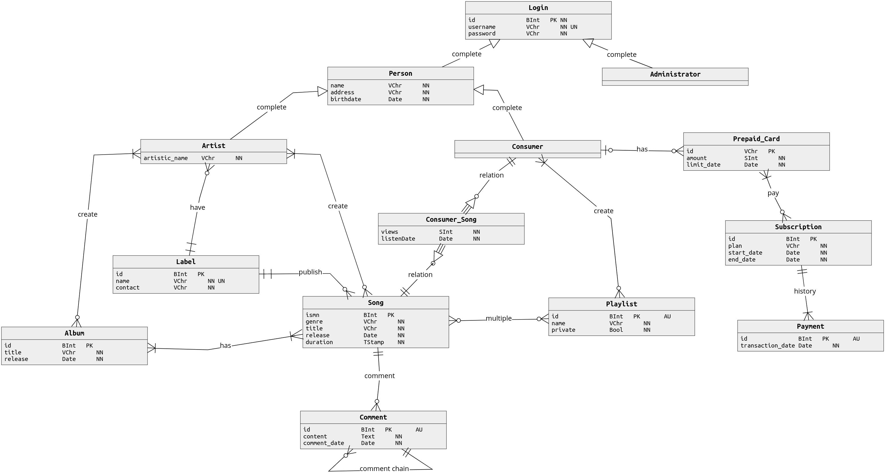
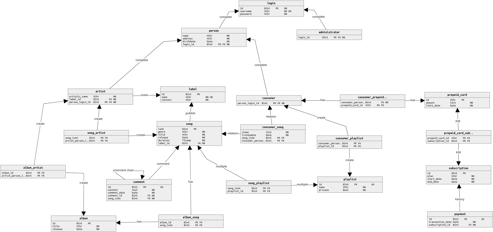

# Oblivion Sound
Velit fugiat reprehenderit ullamco excepteur laboris exercitation ut culpa ad. Sit sit reprehenderit ea cillum deserunt reprehenderit voluptate. Esse culpa sit qui nostrud sit reprehenderit ullamco Lorem. Anim id fugiat in duis consequat consectetur duis sunt amet aliqua nulla. Ipsum ex ea ad pariatur ipsum anim consequat labore esse magna reprehenderit ex do dolor. Fugiat nostrud excepteur pariatur fugiat voluptate tempor eiusmod fugiat minim. Qui dolor consectetur nisi laboris enim culpa ex laborum.

---
## Main Operations:
- ### **Administrator**
  - Create artist accounts
  - Create pre-paid cards (10, 25 or 50)
- ### **Consumer**
  - **Consumer w/o subscription**
    - Create their account
    - Buy a pre-paid card
    - Buy a subscription (month, quarter or semester)
  - **Consumer w/ subscription**
    - Create playlists (public or private)
    - Add songs to their playlists
    - Remove songs from their playlists
    - Access their private playlists
    - Update their playlist name
    - Delete their playlists
  - **Both**
    - Comment on songs or on another comments
    - Access to all songs, albums and public playlists
    - Have a playlist with their top 10 most played songs (last 30 days)
    - Update and delete their account
- ### **Artist**
  - Create albums
  - Create songs
  - Update their account information

## Potential concurrency conflicts:
- Creating a new account:
  - The same username can't be used twice
- Simultaneous comments:
  - Multiple comments at the same time can cause the comments to be out of order or to be with the wrong content
- Simultaneous subscriptions and pre-paid cards
- Simultaneous playlist creation, update and deletion
- Simultaneous song creation, update and deletion
- Simultaneous album creation, update and deletion

## ER diagram (Conceptual Model):

  
  <b>Figure 1:</b> Conceptual Model - <i>can be changed</i>

## Entities, attributes and constraints:
- ### **Login**
  - **id**: bigint, primary key
  - **username**: varchar(32), not null, unique
  - **password**: varchar(64), not null
- ### **Administrator**
  - *no attributes*
- ### **Person**
  - **name**: varchar(256), not null
  - **address**: varchar(256), not null
  - **birthdate**: date, not null
- ### **Consumer**
  - *no attributes*
- ### **Artist**
  - **artistic_name**: varchar(128), not null
- ### **Label**
  - **id**: bigint, primary key
  - **name**: varchar(128), not null
  - **contact**: varchar(128), not null
- ### **Album**
  - **id**: bigint, primary key
  - **title**: varchar(64), not null
  - **release**: date, not null
- ### **Song**
  - **ismn**: bigint, primary key
  - **genre**: varchar(16), not null
  - **title**: varchar(64), not null
  - **release**: date, not null
  - **duration**: time, not null
- ### **Consumer_Song**
  - weak entity
  - **views**: smallint, not null, default 0
  - **listenDate**: date, not null
- ### **Playlist**
  - **id**: bigint, primary key, auto increment
  - **name**: varchar(64), not null
  - **private**: boolean, not null, default true
- ### **Comment**
  - **id**: bigint, primary key, auto increment
  - **content**: text(512), not null
  - **comment_date**: date, not null
- ### **Prepaid_Card**
  - **id**: varchar(16), primary key
  - **amount**: smallint, not null, constraint: amount = 10 | 25 | 50
- ### **Subscription**
  - **id**: bigint, primary key, auto increment
  - **plan**: varchar(16), not null, constraint: type = month | quarter | semester
  - **start_date**: date, not null
  - **end_date**: date, not null
- ### **Payment**
  - **id**: bigint, primary key, auto increment
  - **transaction_date**: date, not null

## Relational data model (Physical Model):

  
  <b>Figure 2:</b> Physical Model - <i>can be changed</i>

 
 
 
 
 

## Authors:
- André Rodrigues Bettencourt Justo Louro
  - **CHANGEME**
- Filipe Alexandre Rodrigues
  - filiperodrigues@student.dei.uc.pt
- Joás Davi Duarte Silva
  - **CHANGEME**
