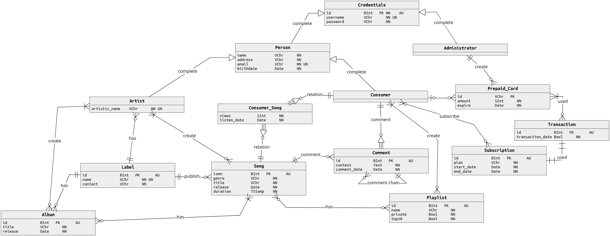

# Oblivion Sound
Our goal is to make a complete and functional database for an hypothetical application named Oblivion Sound, for the time we have designed a visual entity-relationship diagram and its attributes.  We will be using SQL as the programming language for the creation of the actual database, where we will manage the data of a music streaming service implementing the needed functionalities for it to be usable and secure.  

---
## Main Operations:
- ### **Administrator**
  - Create artist accounts
  - Create a specific number of pre-paid cards (10, 25 or 50)
  - Create labels
- ### **Consumer**
  - Create their account
  - Buy a subscription (month, quarter or semester) using pre-paid cards
  - Have a playlist with their top 10 most played songs (last 30 days)
  - Comment on songs or on another comments
  - Access to all songs, albums and public playlists
  - **Consumer w/ subscription**
    - Create playlists (public or private)
- ### **Artist**
  - Create albums
  - Create songs

## Potential concurrency conflicts:
- Creating a new account using the same username at the same time
- Simultaneous comments on the same song/comment
- Same consumer subscribing to a plan using the same pre-paid cards
- Creating a new album
- Creating a new song with the same artists

## ER diagram (Conceptual Model):

  
  <b>Figure 1:</b> Conceptual Model - <i>can be changed</i>

## Entities, attributes and constraints:
- ### **Credentials**
  - **id**: bigserial, primary key
  - **username**: varchar(32), not null, unique
  - **password**: varchar(128), not null
- ### **Administrator**
  - **id**: bigint, primary key (fk to Credentials)
- ### **Person**
  - **id**: bigint, primary key (fk to Credentials)
  - **name**: varchar(256), not null
  - **address**: varchar(256), not null
  - **email**: varchar(128), not null, unique
  - **birthdate**: date, not null
- ### **Consumer**
  - **id**: bigint, primary key (fk to Person)
- ### **Artist**
  - **id**: bigint, primary key (fk to Person)
  - **artistic_name**: varchar(128), not null, unique
  - **label_id**: bigint, fk to Label
- ### **Label**
  - **id**: bigserial, primary key
  - **name**: varchar(128), not null, unique
  - **contact**: varchar(128), not null
- ### **Album**
  - **id**: bigserial, primary key
  - **title**: varchar(64), not null
  - **release**: date, not null
  - **label_id**: bigint, fk to Label
- ### **Song**
  - **ismn**: bigserial, primary key
  - **label_id**: bigint, fk to Label
  - **genre**: varchar(16), not null
  - **title**: varchar(64), not null
  - **release**: date, not null
  - **duration**: timestamp, not null
- ### **Consumer_Song**
  - **consumer_id**: bigint, fk to Consumer
  - **song_ismn**: bigint, fk to Song
  - **views**: smallint, not null, default 0
  - **listen_date**: date, not null
- ### **Playlist**
  - **id**: bigserial, primary key
  - **name**: varchar(64), not null
  - **private**: bool, not null
  - **top10**: bool, not null, default false
- ### **Comment**
  - **id**: bigserial, primary key
  - **content**: text, not null
  - **comment_date**: date, not null
  - **parent_id**: bigint, fk to Comment
  - **consumer_id**: bigint, fk to Consumer
  - **song_ismn**: bigint, fk to Song
- ### **Prepaid_Card**
  - **id**: varchar(16), primary key
  - **amount**: smallint, not null, constraint: amount = 10 | 25 | 50
  - **admin_id**: bigint, not null, fk to Administrator
  - **expire**: date, not null
  - **consumer_id**: bigint, fk to Consumer
- ### **Transaction**
  - **id**: bigserial, primary key
  - **transaction_date**: date, not null
- ### **Subscription**
  - **id**: bigserial, primary key
  - **plan**: varchar(32), not null, constraint: type = month | quarter | semester
  - **start_date**: date, not null
  - **end_date**: date, not null
  - **t_id**: bigint, fk to Transaction

 

## Authors:
- André Rodrigues Bettencourt Justo Louro
  - andrelouro@student.dei.uc.pt
- Filipe Alexandre Rodrigues
  - filiperodrigues@student.dei.uc.pt
- Joás Davi Duarte Silva
  - joassilva@student.dei.uc.pt

## Grade
- 6.95 / 9
